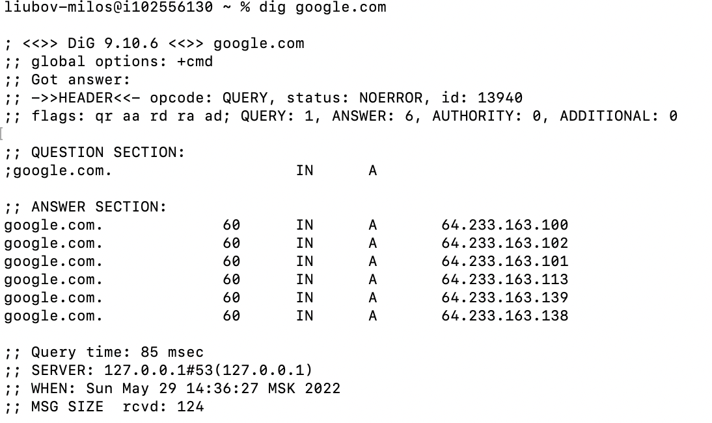
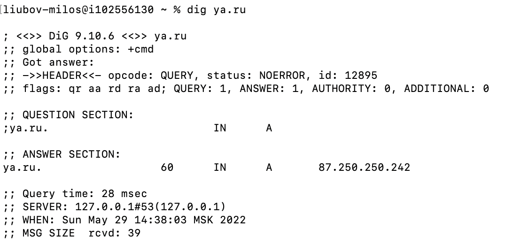
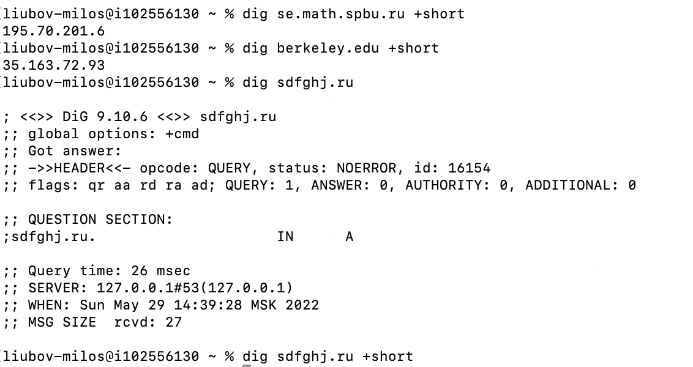

# dns-resolver
## Start
Set up your DNS-server, for example for mac OS:
```bash
% sudo scutil
> list
> get State:/Network/Service/***/DNS
> d.show
> d.add ServerAddresses 127.0.0.1 8.8.8.8 
> set State:/Network/Service/***/DNS
> d.show
> quit
```
Then run:
```bash
python3 -m pip install -r requirements.txt
sudo python3 src/main.py 
```

## Examples of results
 
 
 
